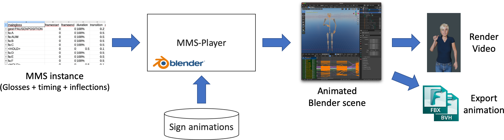
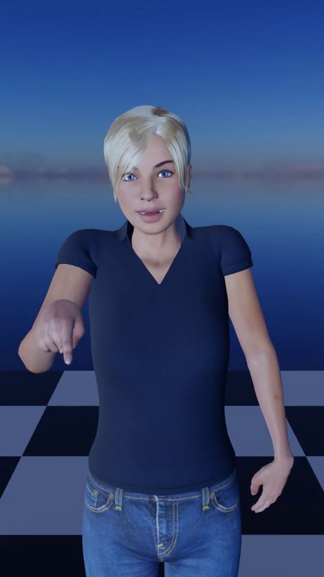
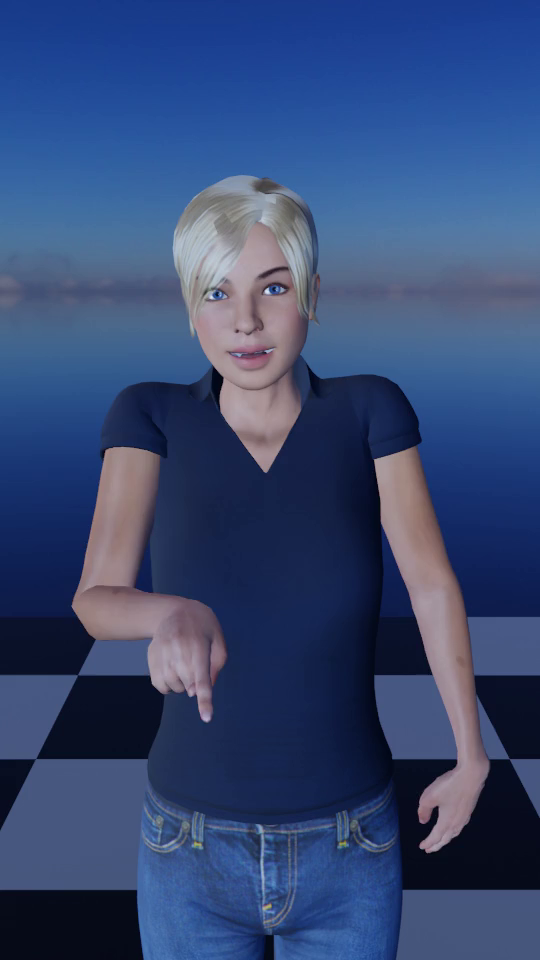
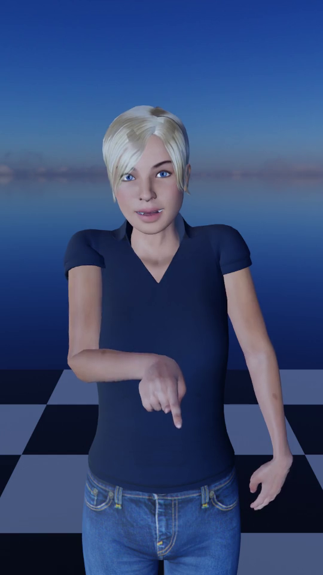

# MMS Player - procedural animation of Sign Language avatars

This repository contains the implementation of an MMS realizer.
MMS stands for "Multimodal SignStream", and it is a machine-and-human-readable format to represent sign languages.

This code, the MMS Player, is able to read an MMS file and produce a SL animation in different formats (MP4, FBX, BVH, JSON animation data, blender scene).



For more information and examples on the MMS, please refer to the included [MMS description](Docs/MMS.md) and set of examples [MMS examples](MMS-examples/README.md).

A video tutorial is available on YouTube.

<a href="https://www.youtube.com/embed/MxiFsxXukZw?si=O56qpwOAE6Rh5GKI" target="_blank" style="display: inline-block;" alt="MMS-Player Video Tutorial on YouTube">
</a>


The implementation is based on the Python language, and it is meant to be executed through the [Blender 3D editor](http://www.blender.org).
For more details on the implementation, please consult the [developers' docs](Docs/DEVELOPERS.md).

This software is distributed under the [GPL 3 license](https://www.gnu.org/licenses/gpl-3.0.html).


## IMPORTANT DISCLAIMER

This software is a research prototype!

At its current stage, it DOES NOT represent whatsoever an application ready for the production of intelligible and quality approved sign language videos. (Notably, facial animation is still missing and under development.)

This repository offers to the research community a baseline for further investigation, collaborations, and improvements in Sign Language synthesis.

We are looking forward for international collaborations through several means:

- International public research projects;
- Applied research with industrial partners;
- Applied research with public institutional bodies;
- Master theses. Possible topics:
  - Facial animation for intelligible sign language (Computer science: procedural animation, machine learning);
  - Advanced interpolation techniques (Computer science: procedural animation, machine learning);
  - Usability: GUI for code-free use (Computer science: web development);
  - Improvement of aesthetics (Schools of art: 3D authoring; Computer graphics).

Native signers pursuing a master in computer science or digital art are particularly welcome to collaborate.

Non-profit organizations for Deaf communities are particularly welcome to try the software and give us feedback.

Universities and research centers are welcome to contact us for possible collaborations.

If interested, please contact [Fabrizio Nunnari](https://github.com/fnunnari), or one of the other developers.

## Documentation

In the following sections, this file explains already how to install and use the MMS Player.

Other documents:

* The [MMS format](Docs/MMS.md) description: the input defining the glosses, their timing, and their inflections.
* The [Developer's docs](Docs/DEVELOPERS.md), for people interested in contributing to the code.

The development of the MMS Player was part of Shailesh Mishra's master thesis at the German Research Center for Artificial Intelligence (DFKI).

  * Shailesh's thesis [Web pages presentation](https://shailesh-mishra.com/thesis/index.html)
  * Shailesh's thesis [video presentation](https://www.youtube.com/watch?v=20dmUm5x5O0)

## Prerequisites

* Blender 4.2.2 LTS
  * (Blender 4.2.1 is known to have a problem with background video rendering)
* A release of the AVASAG Corpus (the small, newer corpus, around 1.8gb size)
  * Get it here: [AVASAG corpus subset for MMS Player](https://cloud.dfki.de/owncloud/index.php/s/RtZ49jY8EF2SaBW)

Optionally, for debugging, install:

* An Environment with Python 3.11
* The bpy namespace
  * `pip install bpy==4.2.0`


### Installing Blender 4.2.2 LTS

* Download and extract the tar.xz, or tar.gz, or zip file from the blender website https://www.blender.org/download/lts/4-2/.

Take note of the path to the main executable file. For example:

```
# On macOS
/Applications/blender-4.2.2/Blender.app/Contents/MacOS/Blender
# On Ubuntu
/home/<user>/blender-4.2.2-linux64/blender
```


## Usage

Basic usage is possible through the command line interface.

First set important directories as env variables. For example, in a Terminal:

```bash
export AVASAG_CORPUS_DIR=path/to/MyCorpusExtract
export BLENDER_EXE=/Applications/blender-4.2.2/Blender.app/Contents/MacOS/Blender
```

Now you should be ready to go!

To generate your first animation, execute the main file through the Blender embedded Python interpreter. E.g.:

```bash
$BLENDER_EXE --background --python main.py -- --source-mms-file MMS-examples/HandReloc-INDEX-X9.mms.csv \
  --corpus-generated-directory $AVASAG_CORPUS_DIR/generated/ \
  --use-relative-time \
  --export-mp4 HandReloc-INDEX-X9.mp4
```

An MP4 video file is generated with the several inflected versions of the INDEX sign.

<p>
  
  
  
</p>

If you want to keep Blender open and watch through the animation of the sign on the timeline, remove the `--background` and `--export-mp4` options and use:

```bash
$BLENDER_EXE --python main.py -- --source-mms-file MMS-examples/HandReloc-INDEX-X9.mms.csv \
  --corpus-generated-directory $AVASAG_CORPUS_DIR/generated/ \
  --use-relative-time
```

The Blender window will open, and you can explore the armature and its animation curves.


## Additional options

The script supports many options. Here a few explained.

If you manually create an MMS, you are likely going to use the `duration` and `transition` columns to specify the time. Then, you should add the option `--use-relative-time`.

If you want to export a video use the `--export-mp4 <path/to/output.mp4>` option.

If you want to specify the dimensions of the video, use this:

    --res-x 1920
    --res-y 1080

If you want to reduce the size of the video, to speed-up rendering, use for example:

    --render-size-pct 50

If you don't want inflections, use: `--without-inflection`

If you want to export to another 3D format, for example for further motion analysis, or import in a game engine, you can use:

    --export-bvh <skeleton_file.bvh>
    --export-fbx <model_file.fbx>


## Web server

The framework provides a Flask HTTP server that can be used to remotely convert MMS instances.

To use the server, make sure you install the Flask package:

    pip install Flask==3.0.3

and then you can run the server.

    export AVASAG_CORPUS_DIR=path/to/MyCorpusExtract
    export BLENDER_EXE=/Applications/blender-4.2.2/Blender.app/Contents/MacOS/Blender
    python RunServer.py

### GET `/api/corpus/sentence/animation/<number>`

Animates the sentence with the given number <number> _already present in the corpus_ and returns it. For example:

    wget localhost:5000/api/sentence/animation/0022


### POST `/api/mms/animation`

Animates the MMS file posted with key "file" into a JSON animation data and returns it.

Parameters:

* `file`: the MMS instance

Example:

    curl --request POST  -F file=@MMS-examples/HandReloc-INDEX-X9.mms.csv http://localhost:5000/api/mms/animation


## References

If you use this work for academic purposes, please cite using at least one of the following entries (first in the list is preferred):

Paper at the SLTAT 2023 workshop: https://ieeexplore.ieee.org/document/10193227. 
Explaining the basic principles of the MMS and the inflection parameters.

```
@INPROCEEDINGS{nunnari23SLTAT-InflectionParameters,
  author={Nunnari, Fabrizio and Mishra, Shailesh and Gebhard, Patrick},
  booktitle={2023 IEEE International Conference on Acoustics, Speech, and Signal Processing Workshops (ICASSPW)}, 
  title={Augmenting Glosses with Geometrical Inflection Parameters for the Animation of Sign Language Avatars}, 
  year={2023},
  volume={},
  number={},
  pages={1-5},
  doi={10.1109/ICASSPW59220.2023.10193227},
  abstract={We present a new machine-readable symbolic representation of sign language based on the pairing of glosses with parameters that can be used for the inflection of motion captured sign animation clips. With respect to existing representations, this approach detaches from a purely linguistic point of view and provides a solution to the problem from a lower-level of abstraction, aiming at generic body-motion manipulation. Early experiments show the effectiveness in manipulating hand trajectories and their potential in modulating the expressivity and communicative emotion of pre-recorded signs.}}
```

Paper at the PETRA conference 2022: https://doi.org/10.1145/3529190.3529202. Explaining the general concept and goals of the AVASAG project.

```
@inproceedings{bernhard22PETRA-AVASAG,
author = {Bernhard, Lucas and Nunnari, Fabrizio and Unger, Amelie and Bauerdiek, Judith and Dold, Christian and Hauck, Marcel and Stricker, Alexander and Baur, Tobias and Heimerl, Alexander and Andr\'{e}, Elisabeth and Reinecker, Melissa and Espa\~{n}a-Bonet, Cristina and Hamidullah, Yasser and Busemann, Stephan and Gebhard, Patrick and J\"{a}ger, Corinna and Wecker, Sonja and Kossel, Yvonne and M\"{u}ller, Henrik and Waldow, Kristoffer and Fuhrmann, Arnulph and Misiak, Martin and Wallach, Dieter},
title = {Towards Automated Sign Language Production: A Pipeline for Creating Inclusive Virtual Humans},
year = {2022},
isbn = {9781450396318},
publisher = {Association for Computing Machinery},
address = {New York, NY, USA},
url = {https://doi.org/10.1145/3529190.3529202},
doi = {10.1145/3529190.3529202},
abstract = {In everyday life, Deaf People face barriers because information is often only available in spoken or written language. Producing sign language videos showing a human interpreter is often not feasible due to the amount of data required or because the information changes frequently. The ongoing AVASAG project addresses this issue by developing a 3D sign language avatar for the automatic translation of texts into sign language for public services. The avatar is trained using recordings of human interpreters translating text into sign language. For this purpose, we create a corpus with video and motion capture data and an annotation scheme that allows for real-time translation and subsequent correction without requiring to correct the animation frames manually. This paper presents the general translation pipeline focusing on innovative points, such as adjusting an existing annotation system to the specific requirements of sign language and making it usable to annotators from the Deaf communities.},
booktitle = {Proceedings of the 15th International Conference on PErvasive Technologies Related to Assistive Environments},
pages = {260--268},
numpages = {9},
keywords = {automatic translation., motion capture, annotation, corpus, sign language production},
location = {Corfu, Greece},
series = {PETRA '22}
}
```

## Authors

* **Shailesh Mishra** was the first and main author of the MMS Player.
* **Fabrizio Nunnari** sketched the original concept of the MMS. He is debugging, mantaining, and testing the software and coordinating further research and developments.

## Links

For other activities on Sign Language, check the Web Page of the [SCAAI group](https://scaai.dfki.de) at DFKI.

## Funding

The following projects/entities are or were funding the development of the MMS player:

Research:

* [German Research Center for Artificial Intelligence (DFKI GmbH)](https://www.dfki.de/)
* [Charamel GmbH](https://www.charamel.com)
* [Alangu](https://alangu.de)
* [TH-Köln](https://www.th-koeln.de)

Projects:
 
* [BIGEKO](https://www.interaktive-technologien.de/projekte/bigeko) (BMBF, grant number 16SV9093)
* [SignReality](https://www.dfki.de/en/web/research/projects-and-publications/project/signreality) (FSTP call from the EU Project UTTER, EU Horizon under Grant Agreement No 101070631)
* [SocialWear](https://affective.dfki.de/socialwear-bmbf-2020-2024/) (BMBF, cost action 22132)
* [AVASAG](https://avasag.de): Avatar-based speech assistant for automatic sign language translation (BMBF, grant number 16SV8491)

